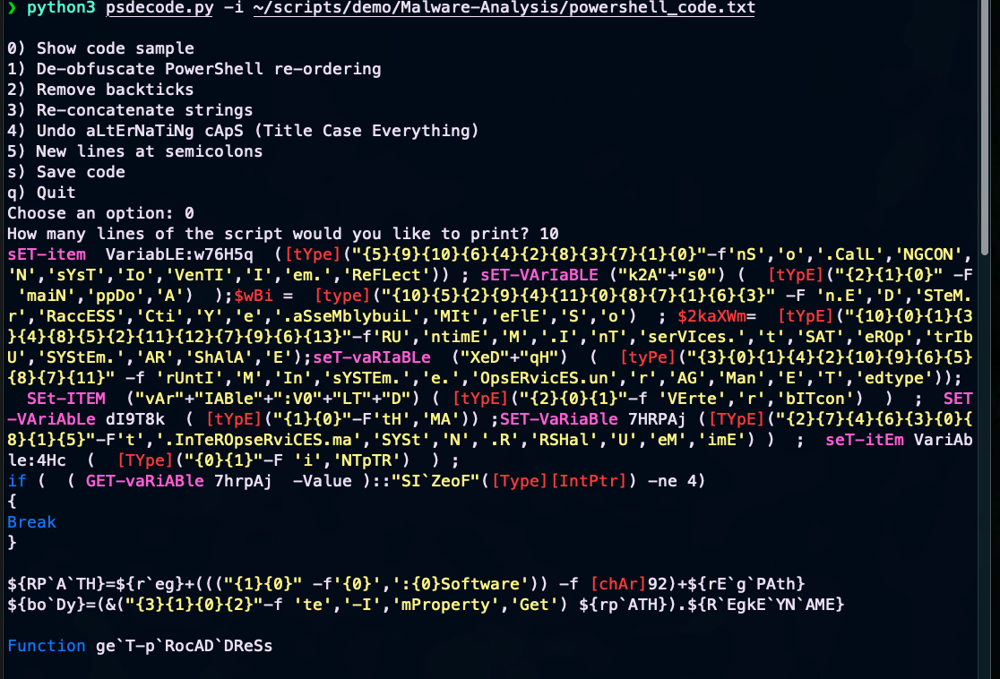
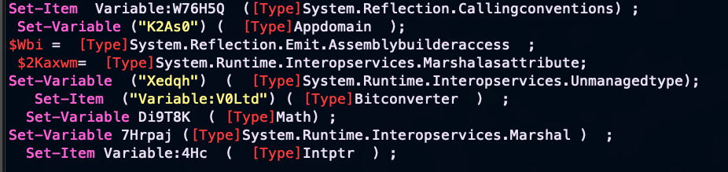

# psdecode.py
Interactive tool for deobfuscating Powershell code.

Usage: `python3 psdecode.py -i obfuscated_powershell.ps1`

This will provide you with an interactive menu:

```
0) Show code sample
1) De-obfuscate PowerShell re-ordering
2) Remove backticks
3) Re-concatenate strings
4) Undo aLtErNaTiNg cApS vAriAbLeS
s) Save code
```

Option 0 is used to check if deobfuscation techniques were successful.

De-obfuscation techniques are separated, since the order of deobfuscation techniques applied may need to be changed, depending on the code.

&nbsp;

More deobfuscation techniques to be added to _soon™_


## Reference: Powershell Obfuscation Techniques

| Technique | Input | Output | Description |
| - | - | - | - |
| Random Case | somestring | **sOMesTriNg** | Some PS variables/names are case insensitive |
| Deconcatenate | somestring | **'som'+'est'+'ring'** | Opposite of concatenate |
| Reorder | somestring | **'{2}{0}{1}'-f'str','ing'some'** | Typically used for inserting variables into command statements, in this case just to jumble string components |
| Back Ticks | somestring | **s\`om\`estr\`in\`g** | Backticks can be used as a line continuation character & sometimes to signify a special character. But, if you use a backtick in the middle of a variable, it continues the line to the next characters in the same line. |
| Call Operator | somestring | **&(somestring)** | Converts a string into a command operation |
| Whitespace | somestring | **'some' &nbsp;+'str'+&nbsp; &nbsp; 'ing'** | Whitespace is irrelevant in some operations, so adding it just makes reading harder.
| Ascii Char Assigns | '\\' | **[cHar]92** | This replaces characters with their ascii codes |


&nbsp;


## Example:

### Before:


### After:



&nbsp;


## External Reference Links:

[Invoke Obfuscation](https://github.com/danielbohannon/Invoke-Obfuscation)

[Revoke Obfuscation (Obfuscation method detection, but no deobfuscation)](https://github.com/danielbohannon/Revoke-Obfuscation)

[Mandiant white paper on Revoke Obfuscation](https://www.mandiant.com/media/22681)
